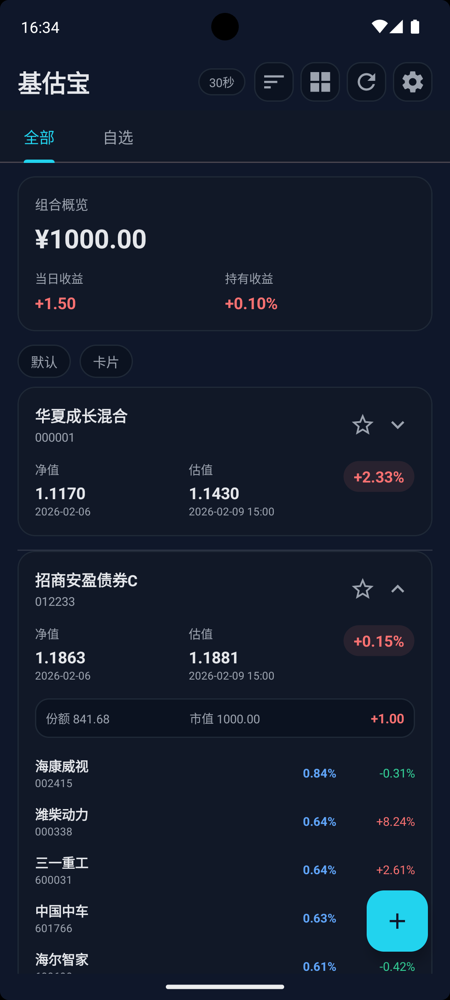
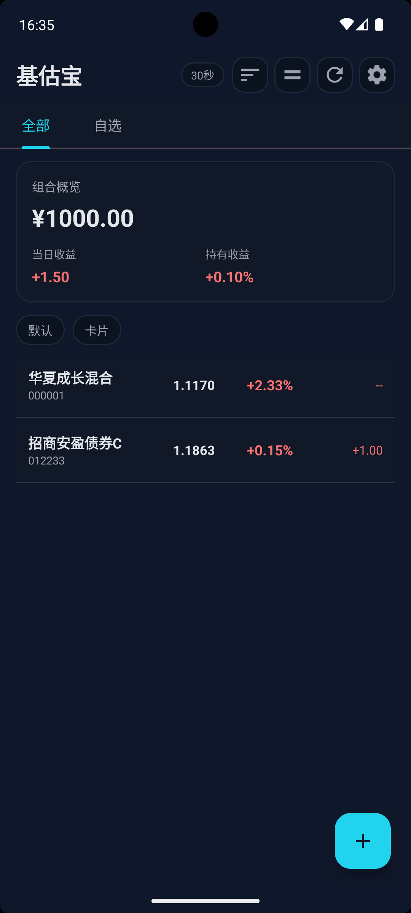

# FundMobile

FundMobile 是 [real-time-fund](https://github.com/hzm0321/real-time-fund) 的 Android（Kotlin）移植版本，面向移动端提供基金实时估值与重仓股跟踪能力。


## 功能特性

- 按基金代码实时获取估值数据
- 跟踪重仓股及盘中涨跌变化
- 支持自选与 Tab 筛选
- 支持分组管理与分组汇总
- 支持持仓与交易记录管理
- 支持下拉刷新与自动刷新间隔设置
- 所有用户数据本地持久化

## 技术栈

- 语言：Kotlin
- UI：Android Views + ViewBinding
- 架构：MVVM
- 网络：OkHttp + Gson + Jsoup
- 并发：Kotlin Coroutines
- 本地存储：SharedPreferences
- 测试：JUnit4、Robolectric、MockWebServer、coroutines-test

## 环境要求

- Android Studio（建议使用最新稳定版）
- JDK 17+
- Android SDK（保持不变）：
  - `compileSdk = 36`
  - `minSdk = 24`
  - `targetSdk = 36`

## 构建与运行

```bash
./gradlew :app:assembleDebug
```

构建完成后的 APK 路径：

`app/build/outputs/apk/debug/app-debug.apk`

## 运行测试

```bash
./gradlew :app:testDebugUnitTest
```

当前单元测试状态：94 通过，0 失败。

## 项目结构

- `app/src/main/java/com/example/fundmobile/data`：API、数据模型、本地存储、仓库层
- `app/src/main/java/com/example/fundmobile/domain`：业务逻辑（收益计算、交易日判断等）
- `app/src/main/java/com/example/fundmobile/ui`：Activity、ViewModel、Fragment、Adapter、BottomSheet
- `app/src/test/java/com/example/fundmobile`：单元测试

## 截图

<div style="display:flex; justify-content:center; gap:16px; align-items:center;"></div>

## 数据来源与免责声明

本项目使用原项目所依赖的公开接口。数据可能存在延迟或不完整，仅供学习与参考，不构成任何投资建议。

## 开源协议

本项目采用与原项目一致的 **GNU Affero General Public License v3.0（AGPL-3.0）**。

- 协议全文：[`LICENSE`](./LICENSE)
- 官方说明：<https://www.gnu.org/licenses/agpl-3.0.html>

## 致谢

- 原项目：<https://github.com/hzm0321/real-time-fund>
- 本仓库为其 Kotlin Android 版本适配实现。
